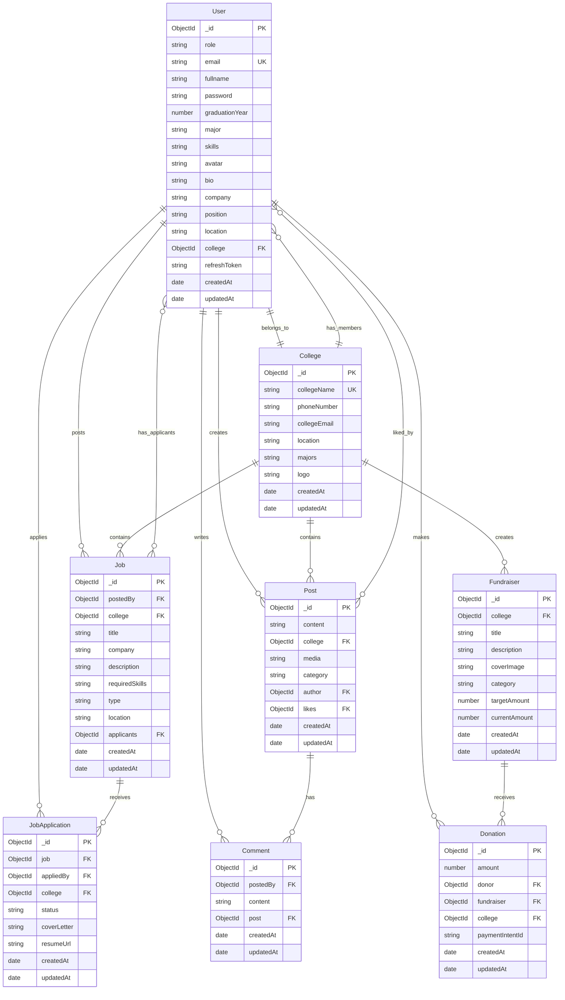
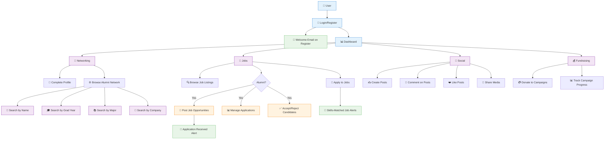

# GradLink - Alumni-Student Networking Platform

  
  
  
  
  

## 🎯 Overview

**GradLink** is a comprehensive full-stack web application designed to bridge the gap between educational institutions' alumni and current students. Our platform facilitates meaningful professional networking, exclusive career opportunities, community-driven fundraising initiatives, and enhanced engagement within college ecosystems. With features like achievement badges, real-time notifications, and secure payment processing, GradLink creates a thriving digital community for educational institutions.

## 🚀 Features

### 👥 Alumni Networking
- 🔍 **View Profiles**: Explore detailed alumni and student profiles, including education, work company and position

### 📰 Social Feed
- 📝 **Create Posts**: Share updates, success stories, and professional tips  
- ❤️ **Like & Comment**: Engage with the community through likes and meaningful discussions  
- 📸 **Media Support**: Share images in posts

### 🏆 Achievement System
- 🎖️ **Donation Badges**: Earn badges for first donations, generous giving, and top supporter status
- 💼 **Career Badges**: Recognition for job posting milestones and recruitment activities
- 📈 **Progress Tracking**: Visual achievement progress across different categories
- 🌟 **Profile Showcase**: Display earned badges prominently on user profiles

### 💼 Job Portal
- 🧑‍💼 **Alumni-Posted Opportunities**: Jobs and internships shared by alumni for students  
- 🔎 **Browse & Apply**: Explore listings and apply directly within the platform

### 📧 Email Notification System
- **Welcome Emails**: Automated welcome messages sent to new users upon registration
- **Job Application Alerts**: Instant notifications to alumni when someone applies to their posted jobs
- **Skills-Matched Job Alerts**: Automatic emails to students when jobs matching their skills are posted

### 💰 Fundraising & Donations
- 🏫 **Event-Based Campaigns**: Support college events, infrastructure, scholarships, etc.  

## 🏗️ Architecture

### Frontend (React + Vite)
- **Framework**: React 19 with modern hooks and functional components
- **Build Tool**: Vite for fast development and optimized production builds
- **UI Components**: shadcn/ui built on top of Radix UI primitives
- **Styling**: Tailwind CSS for responsive and modern design
- **Routing**: React Router v7 for client-side navigation
- **HTTP Client**: Axios with credentials for API communication

### Backend (Node.js + Express)
- **Runtime**: Node.js with ES6 modules
- **Framework**: Express.js with RESTful API architecture
- **Database**: MongoDB with Mongoose ODM for schema modeling
- **Authentication**: JWT-based authentication with access and refresh tokens
- **File Storage**: Cloudinary integration for image and document storage
- **Email Service**: Nodemailer for automated email notifications
- **Payment Processing**: Stripe integration for secure donations

## 🔧 Tech Stack

### Frontend Technologies

### Backend Technologies

### Infrastructure & Services

 

## 📊 Database Schema

GradLink uses MongoDB with Mongoose ODM for data modeling. The database follows a document-based structure with well-defined relationships between collections.

### Entity Relationship Diagram

## 📱 User Roles & Permissions

### 🎓 Students
- Complete profile management with graduation tracking
- Browse and apply to exclusive alumni-shared job opportunities
- Participate in social discussions and content sharing
- Support fundraising initiatives through secure donations
- Access college statistics and community insights

### 👔 Alumni
- All student features plus additional privileges
- Create and manage job postings for the community
- Review and manage job applications with candidate insights
- Build professional reputation through platform contributions

## 🔄 GradLink Platform Overview

---

  
⭐ If you found this project helpful, please give it a star!

  
Built with ❤️ for connecting educational communities

