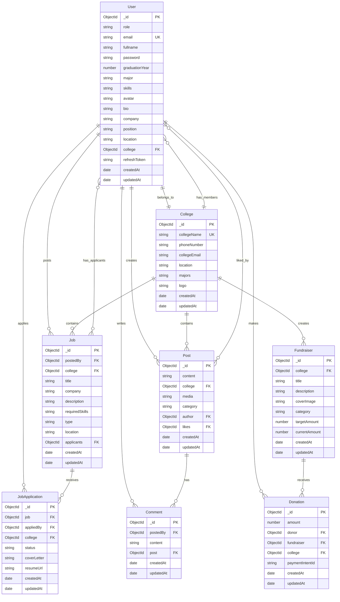

# GradLink - Alumni-Student Networking Platform

<div align="center">

  [](https://nodejs.org/)
  [](https://reactjs.org/)
  [](https://www.mongodb.com/)
  [](https://vercel.com/)
</div>

## 🎯 Overview

**GradLink** is a comprehensive full-stack web application that bridges the gap between educational institutions' alumni and current students. It facilitates professional networking, career opportunities, fundraising initiatives, and community engagement within college ecosystems.

### 🌟 Key Value Propositions

- **Professional Networking**: Connect students with alumni for mentorship and career guidance
- **Exclusive Job Portal**: Access to alumni-shared job opportunities and career openings
- **Community Fundraising**: Support alma mater through secure donation campaigns
- **Social Engagement**: Share achievements, updates, and professional insights
- **Career Development**: Direct access to industry professionals and job opportunities

## 🏗️ Architecture

### Frontend (React + Vite)
- **Framework**: React 19 with modern hooks and functional components
- **Build Tool**: Vite for fast development and optimized production builds
- **UI Library**: Radix UI primitives with custom components
- **Styling**: Tailwind CSS for responsive and modern design
- **Routing**: React Router v7 for client-side navigation
- **State Management**: React hooks for efficient state handling
- **HTTP Client**: Axios with credentials for API communication

### Backend (Node.js + Express)
- **Runtime**: Node.js with ES6 modules
- **Framework**: Express.js with RESTful API architecture
- **Database**: MongoDB with Mongoose ODM for schema modeling
- **Authentication**: JWT-based authentication with access and refresh tokens
- **File Storage**: Cloudinary integration for image and document storage
- **Email Service**: Nodemailer for automated email notifications
- **Payment Processing**: Stripe integration for secure donations


## 🔧 Tech Stack

### Frontend Dependencies
```json
{
  "core": ["React 19", "Vite 6.3", "React Router 7.6"],
  "ui": ["Radix UI", "Tailwind CSS 4.1", "Lucide React"],
  "utilities": ["Axios", "Clsx", "Tailwind Merge"],
  "integrations": ["Stripe", "Socket.io Client", "React Timeago"]
}
```

### Backend Dependencies
```json
{
  "core": ["Node.js", "Express 5.1", "MongoDB", "Mongoose 8.15"],
  "authentication": ["JWT", "bcrypt"],
  "fileUpload": ["Multer", "Cloudinary"],
  "email": ["Nodemailer"],
  "payment": ["Stripe 18.3"],
  "utilities": ["CORS", "Cookie Parser", "dotenv"]
}
```

## 🚀 Features

### 👥 User Management
- **Multi-role System**: Students, Alumni, and Admin roles
- **Secure Authentication**: JWT-based login with session management
- **Profile Management**: Comprehensive user profiles with completion tracking
- **College Integration**: Multi-college support with role-based access

### 💼 Job Portal
- **Job Posting**: Alumni can post job opportunities with detailed requirements
- **Smart Applications**: Resume upload, cover letter, and application tracking
- **Skills Matching**: Algorithm-based job recommendations
- **Application Management**: Status tracking and candidate management
- **Email Notifications**: Automated updates for applications and new opportunities

### 🌐 Social Platform
- **Post Creation**: Text posts with media attachments and link detection
- **Social Interactions**: Like/unlike posts and threaded comment system
- **Content Management**: Personal post management and categorization
- **Real-time Updates**: Live engagement tracking and notifications

### 💰 Fundraising Hub
- **Campaign Creation**: Create fundraising initiatives with goals and descriptions
- **Secure Payments**: Stripe integration for donation processing
- **Progress Tracking**: Real-time donation tracking with visual progress indicators
- **Donation History**: Complete transaction history and receipts

### 📊 Admin Dashboard
- **College Management**: Register and manage college information
- **User Analytics**: Comprehensive statistics on users, jobs, and fundraisers
- **Platform Oversight**: Administrative controls and system monitoring
- **Data Insights**: Dashboard with key metrics and performance indicators

### 🔍 Advanced Search & Discovery
- **Multi-criteria Search**: Search across users, jobs, and content
- **Smart Filtering**: Filter by graduation year, major, location, and skills
- **Skills Matching**: Algorithm-based recommendations for networking and jobs
- **Location-based Discovery**: Geographic filtering for opportunities


## 📁 Project Structure

```
Gradlink/
├── Backend/
│   ├── src/
│   │   ├── controllers/           # API endpoint handlers
│   │   │   └── user.controller.js # Main controller with all endpoints
│   │   ├── models/               # Database schemas
│   │   │   ├── User.model.js     # User schema with auth methods
│   │   │   ├── Job.model.js      # Job posting schema
│   │   │   ├── Post.model.js     # Social post schema
│   │   │   ├── Fundraiser.model.js # Fundraising campaign schema
│   │   │   ├── JobApplication.model.js # Job application tracking
│   │   │   ├── Comment.model.js  # Comment system schema
│   │   │   ├── Donation.model.js # Donation records
│   │   │   └── College.model.js  # College information schema
│   │   ├── middlewares/          # Custom middleware
│   │   │   ├── auth.middleware.js # JWT authentication
│   │   │   ├── multer.middleware.js # File upload handling
│   │   │   └── verifyalum.middleware.js # Alumni role verification
│   │   ├── routes/               # API routes
│   │   │   └── user.routes.js    # All API endpoints
│   │   ├── utils/                # Utility functions
│   │   │   ├── cloudinary.js     # File upload utilities
│   │   │   ├── ApiError.js       # Error handling
│   │   │   ├── ApiResponse.js    # Response formatting
│   │   │   ├── asynchandler.js   # Async error handling
│   │   │   ├── EmailService.js   # Email templates
│   │   │   └── SendMailUtil.js   # Email sending utilities
│   │   ├── db/
│   │   │   └── index.js          # Database connection
│   │   ├── app.js                # Express app configuration
│   │   └── index.js              # Server entry point
│   ├── public/                   # Temporary file storage
│   └── package.json              # Backend dependencies
├── Frontend/
│   ├── src/
│   │   ├── components/           # React components
│   │   │   ├── ui/               # Reusable UI components
│   │   │   ├── Homepage.jsx      # Dashboard component
│   │   │   ├── JobsPage.jsx      # Job listings
│   │   │   ├── JobDetailsPage.jsx # Job detail view
│   │   │   ├── PostJobPage.jsx   # Job creation form
│   │   │   ├── MyJobsPage.jsx    # Personal job management
│   │   │   ├── JobApplicationsPage.jsx # Application management
│   │   │   ├── MyJobApplicationsPage.jsx # Personal applications
│   │   │   ├── Network.jsx       # Alumni network
│   │   │   ├── ProfilePage.jsx   # User profile management
│   │   │   ├── OtherUserProfilePage.jsx # View other profiles
│   │   │   ├── PostsPage.jsx     # Social posts feed
│   │   │   ├── FundraisersPage.jsx # Fundraising campaigns
│   │   │   ├── MyDonationsPage.jsx # Donation history
│   │   │   ├── AdminDashboard.jsx # Admin panel
│   │   │   ├── CollegeRegisterPage.jsx # College registration
│   │   │   └── Header.jsx        # Navigation header
│   │   ├── lib/
│   │   │   └── utils.js          # Utility functions
│   │   ├── App.css               # Global styles
│   │   ├── index.css             # Tailwind imports
│   │   ├── main.jsx              # App entry point with routing
│   │   ├── Layout.jsx            # App layout wrapper
│   │   ├── TabsLayout.jsx        # Tabbed navigation layout
│   │   ├── LandingPage.jsx       # Public landing page
│   │   └── info.js               # API configuration
│   ├── public/                   # Static assets
│   ├── index.html                # HTML template
│   ├── vite.config.js            # Vite configuration
│   ├── vercel.json               # Vercel deployment config
│   └── package.json              # Frontend dependencies
├── FEATURES.md                   # Detailed feature documentation
└── README.md                     # This file
```

## 🔐 Security Features

- **Password Encryption**: bcrypt hashing for secure password storage
- **JWT Authentication**: Stateless authentication with access and refresh tokens
- **Input Validation**: Comprehensive server-side validation and sanitization
- **File Security**: Secure file upload with type validation
- **CORS Configuration**: Properly configured cross-origin resource sharing
- **Environment Variables**: Secure configuration management


## 📱 User Roles & Permissions

### 🎓 Students
- Complete profile management with graduation tracking
- Browse and apply to exclusive alumni-shared job opportunities
- Network with alumni and fellow students
- Participate in social discussions and content sharing
- Support fundraising initiatives through secure donations
- Access college statistics and community insights

### 👔 Alumni
- All student features plus additional privileges
- Create and manage job postings for the community
- Review and manage job applications with candidate insights
- Lead fundraising campaigns for alma mater initiatives
- Mentor students through direct networking
- Share professional insights and career opportunities

### ⚙️ Administrators
- College registration and comprehensive management
- User management with role assignment and oversight
- Fundraiser administration and campaign monitoring
- Platform analytics with detailed insights and metrics
- System configuration and maintenance tools
- Content moderation and community management


## 📊 Database Schema

GradLink uses MongoDB with Mongoose ODM for data modeling. The database follows a document-based structure with well-defined relationships between collections.

### Entity Relationship Diagram



#### 👤 **User Model**
```javascript
{
  _id: ObjectId,              // Primary Key
  role: String,               // Required: "student" | "alumni" | "admin"
  email: String,              // Required, Unique, Indexed
  fullname: String,           // Required
  password: String,           // Required, Bcrypt Hashed
  graduationYear: Number,     // Optional
  major: String,              // Optional
  skills: [String],           // Array of skills for job matching
  avatar: String,             // Profile picture URL (Cloudinary)
  bio: String,                // Optional bio text
  company: String,            // Current company
  position: String,           // Current job position
  location: String,           // Geographic location
  college: ObjectId,          // Reference to College
  refreshToken: String,       // JWT refresh token
  createdAt: Date,            // Auto-generated
  updatedAt: Date             // Auto-generated
}
```

#### 🏫 **College Model**
```javascript
{
  _id: ObjectId,              // Primary Key
  collegeName: String,        // Required, Unique
  phoneNumber: String,        // Required
  collegeEmail: String,       // Required
  location: String,           // Optional
  majors: [String],           // Array of available majors
  logo: String,               // College logo URL (Cloudinary)
  createdAt: Date,            // Auto-generated
  updatedAt: Date             // Auto-generated
}
```

### Collection Details

#### 👥 Users Collection
- **Purpose**: Store user profiles for students, alumni, and administrators
- **Key Features**: 
  - Role-based access control (student/alumni/admin)
  - JWT authentication with bcrypt password hashing
  - Skills tracking for job matching algorithms
  - College affiliation for community segmentation
- **Validation**: Required fields enforced, unique email constraint
- **Indexes**: Email (unique), college (compound), role + college

#### 🏫 Colleges Collection
- **Purpose**: Educational institution profiles and configuration
- **Key Features**:
  - Multi-college platform support
  - Major/department listings for accurate user categorization
  - Contact information and branding (logo)
- **Relationships**: Central hub for all platform activities
- **Validation**: Unique college names, required contact information

#### 💼 Jobs Collection
- **Purpose**: Job postings shared by alumni for community members
- **Key Features**:
  - Alumni-only posting privileges
  - Skill-based job matching algorithms
  - Application tracking through applicants array
  - Type categorization (full-time/part-time/internship)
- **Access Control**: Only alumni can create, all users can view/apply
- **Indexes**: College + type, postedBy, requiredSkills (text search)

#### 📄 JobApplications Collection
- **Purpose**: Track job application lifecycle and status
- **Key Features**:
  - Status management (pending/accepted/rejected)
  - Resume and cover letter storage via Cloudinary
  - College-wise application processing
- **Workflow**: Application → Review → Status Update → Email Notification
- **Relationships**: Links Job, User (applicant), and College

#### 📱 Posts Collection
- **Purpose**: Social networking and community engagement
- **Key Features**:
  - Media attachments via Cloudinary integration
  - Like/unlike functionality with user tracking
  - College-specific content feeds
  - Category-based content organization
- **Real-time**: Live engagement updates using aggregation pipelines
- **Content Management**: Author-controlled editing and deletion

#### 💬 Comments Collection
- **Purpose**: Threaded discussions on posts
- **Key Features**:
  - Nested comment support structure
  - Real-time comment streaming
  - Author verification and content validation
- **Moderation**: College-admin moderation capabilities
- **Performance**: Paginated loading for large comment threads

#### 🎯 Fundraisers Collection
- **Purpose**: College fundraising campaigns and initiatives
- **Key Features**:
  - Goal tracking with real-time progress calculation
  - Category-based campaign organization
  - Visual campaign management with cover images
- **Financial Tracking**: Integration with Donation collection for accuracy
- **Transparency**: Public progress visibility and milestone tracking

#### 💰 Donations Collection
- **Purpose**: Secure donation transaction records
- **Key Features**:
  - Stripe payment integration with paymentIntentId tracking
  - Complete transaction history and receipt generation
  - Multi-college donation support
  - Automatic fundraiser progress updates
- **Security**: PCI-compliant payment processing, encrypted transaction data
- **Reporting**: Comprehensive donation analytics and tax documentation

### Database Design Principles

#### 🔗 Relationship Patterns
- **One-to-Many**: User → Posts, Jobs, Comments, Donations
- **Many-to-One**: Users → College (community segmentation)
- **Many-to-Many**: Users ↔ Jobs (via JobApplications), Users ↔ Posts (via likes)
- **Reference Strategy**: ObjectId references for optimal query performance

#### 📈 Performance Optimizations
- **Indexes**: Strategic indexing on frequently queried fields
- **Aggregation Pipelines**: Complex queries with data transformation
- **Pagination**: Built-in mongoose-aggregate-paginate-v2 for large datasets
- **Caching Strategy**: Application-level caching for static college data

#### 🔒 Data Integrity
- **Validation**: Mongoose schema validation with custom validators
- **Constraints**: Unique constraints on critical fields (email, college names)
- **Referential Integrity**: Proper foreign key relationships
- **Timestamps**: Automatic createdAt/updatedAt tracking on all collections

#### 🚀 Scalability Considerations
- **Horizontal Scaling**: MongoDB sharding capability for growth
- **Index Strategy**: Compound indexes for complex query patterns
- **Data Archival**: Strategy for historical data management
- **Connection Pooling**: Optimized database connection management

## 🎨 UI/UX Features

- **Responsive Design**: Mobile-first design that works on all devices
- **Modern Interface**: Clean, professional design with gradient accents
- **Interactive Components**: Smooth animations and transitions
- **Accessibility**: ARIA labels and keyboard navigation support
- **Dark Mode Ready**: Prepared for dark theme implementation
- **Performance Optimized**: Lazy loading and code splitting

## 🔄 Workflow Examples

### Job Application Process
1. Alumni posts job opportunity with requirements
2. System matches job with student skills and sends email notifications
3. Students browse jobs and apply with resume and cover letter
4. Alumni reviews applications and updates status
5. Email notifications sent for status updates

### Fundraising Campaign
1. User creates fundraising campaign with goal and description
2. Campaign appears on fundraisers page with progress tracking
3. Community members make secure donations via Stripe
4. Real-time progress updates and milestone notifications
5. Complete donation history and receipt management

## 🚀 Deployment

### Production URLs
- **Frontend**: [https://gradlink-neon.vercel.app](https://gradlink-neon.vercel.app)
- **Backend**: [https://gradlink-0aro.onrender.com](https://gradlink-0aro.onrender.com)

### Deployment Platforms
- **Frontend**: Vercel (with automatic deployments)
- **Backend**: Render (with continuous deployment)
- **Database**: MongoDB Atlas (cloud-hosted)
- **File Storage**: Cloudinary (CDN-optimized)

## 🤝 Contributing

1. Fork the repository
2. Create a feature branch (`git checkout -b feature/amazing-feature`)
3. Commit your changes (`git commit -m 'Add amazing feature'`)
4. Push to the branch (`git push origin feature/amazing-feature`)
5. Open a Pull Request

## 📝 License

This project is licensed under the MIT License - see the [LICENSE](LICENSE) file for details.

## 👨‍💻 Author

**Anuj Kamdar**
- GitHub: [@anujkamdar](https://github.com/anujkamdar)
- Email: anuj@example.com

## 🙏 Acknowledgments

- **Radix UI** for accessible component primitives
- **Tailwind CSS** for utility-first styling
- **Cloudinary** for reliable file storage
- **Stripe** for secure payment processing
- **MongoDB** for flexible document database
- **Vercel** for seamless frontend deployment

---

<div align="center">
  <p>⭐ If you found this project helpful, please give it a star!</p>
  <p>Built with ❤️ for connecting educational communities</p>
</div>
